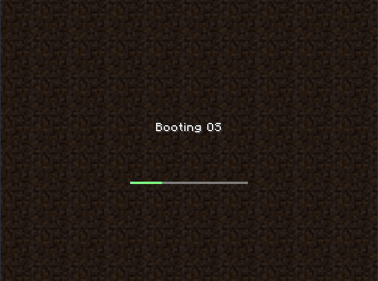
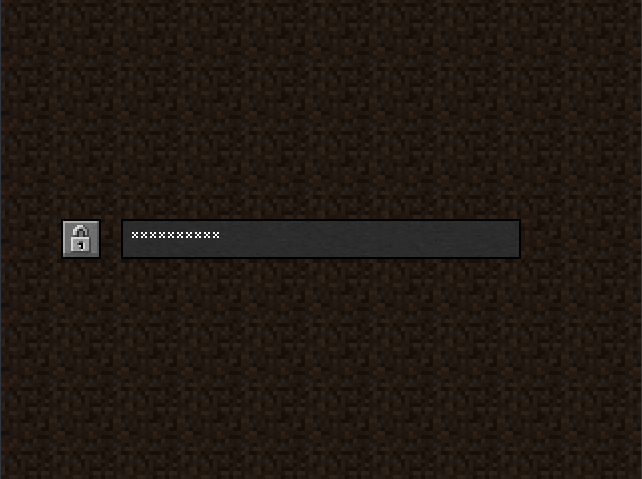
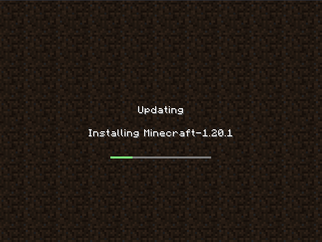

Minecraft Plymouth theme
------------------------

A minecraft loading screen styled Plymouth theme, inspired by
[MineGRUB](https://github.com/Lxtharia/minegrub-theme).

Mostly created as a silly joke, it's meant to be used together
with MineGRUB for the most authentic Minecraft boot experiece(tm).

But it also can be used alone, I am not here to judge.


### Screenshots






### How do I install?

If you use a OS which follows the POSIX filesystem structure (``/etc``, ``/usr`` and friends), the installation is as simple as:

First, install ``git``, ``plymouth`` and ``imagemagick``. On Fedora, also install ``plymouth-plugin-script``.

And do the following:

```
    git clone https://github.com/nikp123/minecraft-plymouth-theme
    cd minecraft-plymouth-theme
    sudo ./install.sh
    plymouth-set-default-theme -R mc
```

Reboot, and you'll have the boot screen installed.


### Distros and whatnot?

So far I've tested this on:
Void Linux and Arch Linux (and a teeny tiny bit of NixOS, but I think it's kinda broken atm)

Other distros *might* work but it would require that their initrd generator is aware of plymouth and this theme, and pulls in the correct files.

So far both ``mkinitcpio`` and ``dracut`` initrd systems are supported. But adding others should be fairly simple.


#### Sidenotes

The theme may not be fully tested, so don't go complaining that it "broke your
setup". Exercise user caution. Test before you install this on your main rig.


### License/Legal

Since we are dealing with Minecraft assets, those come with the license agreement
from the game itself. I'm sure Mojang/Microsoft won't mind some random textures
being redistributed as long as they don't infringe on their game. But it's worth
keeping in mind.

The font, however, isn't fully from the game and came from
[here](https://github.com/IdreesInc/Minecraft-Font/blob/main/Minecraft.otf).
Hence, their license terms apply.

As for the theme, code and config files they're under the terms of the MIT.
[See LICENSE](LICENSE)


### Future?

I could work on this a bit further but my greatest limiting factor is the
subjectively awful programming interface for Plymouth themes. I'm sure the guys
at FreeDesktop didn't intend for full programs to be written with their scripting
language, but it severly limits me what I can do. Hence the project is kinda
stuck, unless I rewrite this in C or Rust (idfk).

